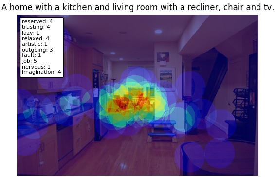

# Cross-modality dataset

### Data
Our data is composed of two files: ads.zip and coco.zip. Both files can be downloaded by our script:

  ```bash
  bash download.sh
  ```
  
Each dataset is composed of two folders ims and bv, and a data.csv file. Ims folder contains images for our experiment, and bv folder contains the bubble_view visualizations (gaze maps). Also, data.csv contains the fields:

- task_id: identifier for task submitted to amazon mechanical turk.
- image: image name.
- ad_msg: text for image annotation or ad message.
- personality: vector for personality survey.
- mturker_id: identifier of amazon mechanical turk worker.

### Example
We also provide an example to visualize our annotations. Please, run:

  ```bash
  python plot_data.py
  ```

and you should obtain the following visualization:
<p align="center">
  
</p>

### Reference
If you use this data, please cite our work:

**Cross-Modality Personalization for Retrieval**. Nils Murrugarra-Llerena and Adriana Kovashka. To appear, Proceedings of the IEEE Conference on Computer Vision and Pattern Recognition (**CVPR**), June 2019.
